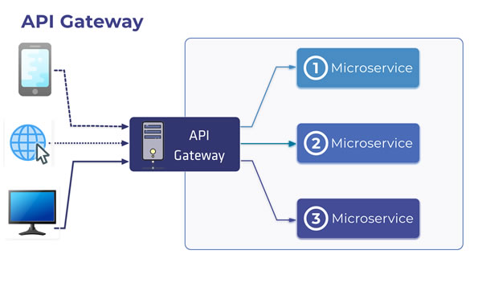

# API GATEWAY com Lumen PHP 

Esta API serve como um exemplo de gateway para a integração de outras APIs. Este gateway faz apenas o controle de usuários utilizando um banco local feito em SQLite, e o roteamento de requisições para outra API. Podem ser instaladas outras APIs, bastando seguir as instruções relatadas a seguir.

A outra API conectada neste gateway (API de Livros) pode ser vista neste link:

> https://github.com/dbins/lumen_api

Recursos disponíveis

* Roteamento de requisições para outra API
* Autenticação com Passport
* Swagger

## CONCEITO DO GATEWAY

A função de um gateway é servir para a integração entre vários serviços. Ao invés de criar um webservice único com todas as funções, cada serviço é criado como uma solução em separado, e depois integrado ao gateway. Desta forma, se facilita a criação, manutenção e testes.

Algumas considerações:

* O gateway serve para atender requisições de qualquer plataforma (Web, PWA, Mobile ou Desktop)
* A troca de informações será feita por JSON
* Ao se autenticar na API, são gerados um token de acesso e um token de refresh
* As rotas de acesso restrito somente poderão ser consumidas se no cabeçalho da requisição for enviado um Bearer Token.
* * Ao expirar o token de acesso, o token de refresh deve ser utilizado para gerar um novo token de acesso.
* Os serviços acoplados ao gateway vão receber requisições com um token enviado pelo gateway
* A autentição apenas vai existir no gateway, os serviços acoplados vão receber os dados a partir dele.
* Como o gateway é um ponto único de acesso para qualquer serviço, os demais serviços não são acessados diretamente pelo cliente
* Como o acesso é por tokens, não existem sessões para persistir os dados dos usuários
  

## INSTALAÇÃO

git clone https://github.com/dbins/api-gateway-php.git
composer install

## CRIAR PROJETO

Para criar o projeto você pode primeiro adicionar o instalador do lumen. Se você já tiver o composer instalado, o comando é este:
> composer global require "laravel/lumen-installer"

Depois, para criar o projeto:
> lumen new nome_do_projeto

Sem adicionar o instalador, o projeto pode ser criado da seguinte forma:
> composer create-project --prefer-dist laravel/lumen nome_do_projeto

Crie uma app_key utilizando o seguinte comando e depois atualize a chave APP_KEY do seu arquivo .env
>php -r "require 'vendor/autoload.php';use Illuminate\Support\Str;echo Str::random(40).PHP_EOL;"

Para testar, pelo terminal, entre dentro da pasta do projeto que foi criada e execute:
> php -S localhost:8001 -t public

A seguir, uma descrição de como foi feita a configuração de cada etapa

### Banco de dados SQLite

Dentro da pasta /database, crie um arquivo em branco chamado database.sqlite

Edite o arquivo .env e crie uma conexão com o banco de dados SQLite que acabou de ser criado

DB_CONNECTION=sqlite

Como o nome e caminho padrão são /database/database.sqlite, apenas a primeira linha é necessária

### Migrations

Agora vamos criar as migrations para o nosso banco de dados. Elas são responsáveis por criar a estrutura e os dados de nosso banco de dados. As migrations serão criadas dentro da pasta /database/migrations

>php artisan make:migration create_users_table --create=users

Para popular a tabela, será necessário criar um Seeder. Por padrão eles ficam dentro da pasta /database/seeds

> php artisan make:seeder UsersTableSeeder

Depois de criar o seeder, atualize o arquivo /database/seeds/DatabaseSeeder.php, adicionando o Seeder para a tabela que foi criada

    public function run()
    {
        $this->call('UsersTableSeeder');
    }
	
Para fazer a carga de dados, execute o comando:

> php artisan migrate --seed

### GATEWAY

Aqui vem o passo das configurações feitas para que o Gateway acesse outras APIs

Criar dentro da pasta /app uma pasta chamada "Traits" e criar dentro dela os arquivos ApiResponder.php e ConsumeExternalService.php. São estes os arquivos que vão fazer a comunicação com todos os webservices que forem instalados no gateway

**Para cada serviço que for acoplado ao gateway, será necessário criar um Service e um Controller.**

Crie uma pasta dentro de /app com o nome de Services e crie o serviço. 

**Será necessário também criar duas variáveis para cada API no arquivo /.env, uma para o endereço e outra para o secret**

    SERVICES_LIVROS_BASE_URI=http://localhost:8000
    SERVICES_LIVROS_SECRET=123456

Dentro de /app/Http/Controllers, crie um controller para o serviço

Os arquivos que foram criados para acessar a outra API foram:

/app/Http/Controllers/LivrosController.php
/app/Services/LivroService.php

Edite o arquivo /routes/web.php e crie as rotas do microserviço

    $router->group([
        'prefix' => 'api/v1',
    ], function () use ($router){
        $router->get('/livros', 'LivrosController@index');
        $router->get('/livros/{id}', 'LivrosController@show');
        $router->post('/livros', 'LivrosController@store');
        $router->patch('/livros/{id}', 'LivrosController@update');
        $router->delete('/livros/{id}', 'LivrosController@destroy');
    });

Crie um Handler para tratar os erros de comunicação em /app/Exceptions/Handler.php

Crie um middleware para restringir o acesso as rotas
Registrar o middleware no arquivo /bootstrap/app.php

    $app->routeMiddleware([
        'jwt.auth' => App\Http\Middleware\JwtMiddleware::class,
    ]);

### PASSPORT

Para proteger o gateway e gerar os tokens para comunicação, será necessário instalar o component Passport
>composer require dusterio/lumen-passport

ATENÇÃO: Antes de rodar este comando, aumentar a memoria do PHP para -1, sem limite. Edite o arquivo php.ini do seu PHP e altere a seguinte linha:

>memory_limit = 300M

Editar o arquivo /bootstrap/app.php e descomentar as seguintes linhas:

    $app->withFacades();
    $app->withEloquent();

Ativar o auth middleware que faz parte do Lumen

    $app->routeMiddleware([
        'auth' => App\Http\Middleware\Authenticate::class,
    ]);

Por último, registrar os dois service providers:    

    $app->register(Laravel\Passport\PassportServiceProvider::class);
    $app->register(Dusterio\LumenPassport\PassportServiceProvider::class);

Criar pasta /config e criar arquivo auth.php

Uma vez feitas estas configurações, para registrar o Passport será necessário executar os seguintes comando no terminal

> php artisan migrate
 
> php artisan passport:install

Editar o arquivo /app/providers/authserviceprovider.php

    public function boot() { \Dusterio\LumenPassport\LumenPassport::routes($this->app->router); }

Editar o modelo usado para utilizar o ORM na tabela de usuários, ele fica em /app/Models/User.php

### JWT

Cada serviço adicionado ao gateway vai enviar dados para o serviço acoplado utilizado um token com o header Authorization. Este token vai ser criptrografado usando JWT.

Para criar o token no formato JWT foi instalado o seguinte componente:

>composer require firebase/php-jwt

O token deve ser usado usando a mesma assinatura disponível no serviço que foi acoplado. A assinatura fica no arquivo .env.

Desta forma, ao enviar o token para o outro serviço, ele poderá ser validado pelo middleware e utilizado no outro serviço. A autenticação apenas vai ser feita do lado do gateway

### SWAGGER

O Swagger é uma ferramenta para documentação de APIs. Ela foi utilizada para documentar o controller.

Para instalar
> composer require zircote/swagger-php

Depois de documentar o Controller, para gerar a documentação você pode executar o comando:
> .\vendor\bin\openapi app -o public/swagger.json

A documentação é gerada no formato JSON. Com base nela, pode ser utilizada uma interface gráfica, para facilitar a consulta. Para instalar a interface gráfica, é necessário primeiro fazer o download deste repositório:

https://github.com/swagger-api/swagger-ui

Depois, copie a pasta "dist" para dentro de /public/swagger. Dentro de /public, você deverá criar esta pasta. Edite o arquivo index.html. alterando o caminho para chegar no arquivo /public/swagger.json

### SWAGGER para os servicos do gateway

Cada serviço deve ter uma rota chamada /api/doc para exportar o arquivo swagger.json gerado para o serviço. Desta forma, a documentação de todos pode ser acessada a partir de um único lugar

Dentro da pasta /public/swagger existe uma versão do Swagger UI instalada. Para acessar a documentação do Gateway (apenas as rotas de autenticação de usuário), basta digitar

> http://localhost:8001/swagger/index.php

Para ver a documentação do outro serviço, o endereço é:

> http://localhost:8001/swagger/index.php?api=livros

O arquivo /public/swagger/index.php deve ser editado sempre que um novo serviço for adicionado ao gateway

### MENSAGENS DE VALIDACAO EM PORTUGUES

Para traduzir para português do Brasil as mensagens de validação geradas pelo request-validate() foi necessário criar a pasta /resources/lang/pt_BR e copiar para esta pasta os arquivos com as validações traduzidas.

Depois, dentro do arquivo /bootstrap/app foi adicionada a seguinte linha depois de carregar os providers

> \Illuminate\Support\Facades\Lang::setLocale('pt_BR');

### LISTAR ROTAS DA APLICAÇÃO

Apesar do Lumen ser baseado no framework Laravel, ele não possui a funcionalidade de listar as rotas pelo terminal. Se faz necessário instalar um componente para poder ter acesso a este recurso.

>composer require thedevsaddam/lumen-route-list

>composer update

Adicionar em /bootstrap/app.php
    $app->register(\Thedevsaddam\LumenRouteList\LumenRouteListServiceProvider::class);

Agora estão disponíveis no terminal os seguintes comandos:
>php artisan route:list

Filtrar rotas que utilizem o método POST
>php artisan route:list --filter=method:post

### CODESNIFFER

Foi instalada uma ferramenta para verificar o código em busca de erros ou melhorias.

Instalação

> composer require --dev "squizlabs/php_codesniffer 3.*"

Para testar o código e alertar sobre problemas:

> .\vendor\bin\phpcs app --standard=PSR12

Para testar o código e corrigir automaticamente:

> .\vendor\bin\phpcbf app --standard=PSR12

### ROTAS DESTA APLICAÇÃO

As rotas marcadas com o middleware "auth" foram criadas ao instalar o Passport
As rotas auth/logout e /auth/user somente podem ser acessadas após autenticar no Passport
As demais rotas vinculadas ao middleware "auth/api" são do outro serviço que deve ser primeiro colocado no ar na porta 8000. 

| Method | URI                               | Name | Action     | Middleware | Map To                                           |
|--------|-----------------------------------|------|------------|------------|--------------------------------------------------|
| POST   | /auth/login                              |      | Controller |            | App\Http\Controllers\AuthController@login                                  |
| POST   | /auth/signup                             |      | Controller |            | App\Http\Controllers\AuthController@signUp                                 |
| POST   | /auth/refresh                            |      | Controller |            | App\Http\Controllers\AuthController@refresh                                |
| GET    | /auth/logout                             |      | Controller | auth:api   | App\Http\Controllers\AuthController@logout                                 |
| GET    | /auth/user                               |      | Controller | auth:api   | App\Http\Controllers\AuthController@user                                   |
| GET    | /api/v1/livros                           |      | Controller | auth:api   | App\Http\Controllers\LivrosController@index                                |
| GET    | /api/v1/livros/{id}                      |      | Controller | auth:api   | App\Http\Controllers\LivrosController@show                                 |
| POST   | /api/v1/livros                           |      | Controller | auth:api   | App\Http\Controllers\LivrosController@store                                |
| PATCH  | /api/v1/livros/{id}                      |      | Controller | auth:api   | App\Http\Controllers\LivrosController@update                               |
| DELETE | /api/v1/livros/{id}                      |      | Controller | auth:api   | App\Http\Controllers\LivrosController@destroy                              |
| POST   | /api/v1/livros/contato                   |      | Controller | auth:api   | App\Http\Controllers\LivrosController@contact                              |
| POST   | /api/v1/livros/upload/{id}               |      | Controller | auth:api   | App\Http\Controllers\LivrosController@upload                               |
| GET    | /api/v1/livros/exportar/{formato}        |      | Controller | auth:api   | App\Http\Controllers\LivrosController@export                               |
| GET    | /api/v1/livros/doc                       |      | Controller |            | App\Http\Controllers\LivrosController@doc                                  |
| POST   | /oauth/token                             |      | Controller |            | \Dusterio\LumenPassport\Http\Controllers\AccessTokenController@issueToken  |
| GET    | /oauth/tokens                            |      | Controller | auth       | \Laravel\Passport\Http\Controllers\AuthorizedAccessTokenController@forUser |
| DELETE | /oauth/tokens/{token_id}                 |      | Controller | auth       | \Laravel\Passport\Http\Controllers\AuthorizedAccessTokenController@destroy |
| POST   | /oauth/token/refresh                     |      | Controller | auth       | \Laravel\Passport\Http\Controllers\TransientTokenController@refresh        |
| GET    | /oauth/clients                           |      | Controller | auth       | \Laravel\Passport\Http\Controllers\ClientController@forUser                |
| POST   | /oauth/clients                           |      | Controller | auth       | \Laravel\Passport\Http\Controllers\ClientController@store                  |
| PUT    | /oauth/clients/{client_id}               |      | Controller | auth       | \Laravel\Passport\Http\Controllers\ClientController@update                 |
| DELETE | /oauth/clients/{client_id}               |      | Controller | auth       | \Laravel\Passport\Http\Controllers\ClientController@destroy                |
| GET    | /oauth/scopes                            |      | Controller | auth       | \Laravel\Passport\Http\Controllers\ScopeController@all                     |
| GET    | /oauth/personal-access-tokens            |      | Controller | auth       | \Laravel\Passport\Http\Controllers\PersonalAccessTokenController@forUser   |
| POST   | /oauth/personal-access-tokens            |      | Controller | auth       | \Laravel\Passport\Http\Controllers\PersonalAccessTokenController@store     |
| DELETE | /oauth/personal-access-tokens/{token_id} |      | Controller | auth       | \Laravel\Passport\Http\Controllers\PersonalAccessTokenController@destroy   |

### LINKS DE REFERÊNCIA

Os seguintes links são material de referência utilizado para a criaçao do gateway e do serviço

**API**
<https://imasters.com.br/back-end/desenvolvendo-uma-aplicacao-web-com-lumen-e-mysql>
<https://auth0.com/blog/developing-restful-apis-with-lumen/>
<https://code.tutsplus.com/pt/tutorials/how-to-secure-a-rest-api-with-lumen--cms-27442>
<https://github.com/dusterio/lumen-passport>
<https://developer.okta.com/blog/2019/06/26/build-secure-microservices-in-php>

**Testes unitários**

<https://medium.com/@stephenjudeso/testing-lumen-api-with-phpunit-tests-555835724b96>
<https://medium.com/@danilolutz/ambiente-de-desenvolvimento-php-com-docker-parte-final-laravel-lumen-tdd-php-unit-8a30d1129503>
<https://imasters.com.br/back-end/phpunit-no-laravel-parte-01>
<https://www.dorusomcutean.com/api-how-to-create-lumen-basic-api/>

**Swagger**

<https://blog.quickadminpanel.com/laravel-api-documentation-with-openapiswagger/>
<https://medium.com/@ivankolodiy/how-to-write-swagger-documentation-for-laravel-api-tips-examples-5510fb392a94>
<http://niceprogrammer.com/lumen-api-tutorial-documentation-using-swagger-ui/>
<https://medium.com/@poweredlocal/developing-a-simple-api-gateway-in-php-and-lumen-f84756cce043>
<https://medium.com/@tatianaensslin/how-to-add-swagger-ui-to-php-server-code-f1610c01dc03>
<https://medium.com/@arikardnoir/documentando-uma-api-rest-laravel-usando-swagger-2daa24b752e0>
<https://jansenfelipe.com.br/2016/04/01/lumen-laravel-como-documentar-uma-api-rest-com-swagger/>

**Token**

<https://panjeh.medium.com/laravel-get-bearer-token-from-a-request-b1b242277e22>
<https://dev.to/ziishaned/jwt-authentication-for-lumen-5-4-3d2m>

**Passport**

<https://medium.com/@filjoseph/how-to-set-up-lumen-passport-4801f7c0e864>
<https://stackoverflow.com/questions/59330402/how-do-i-get-a-refresh-token-in-laravel-passport>
<https://laracasts.com/discuss/channels/laravel/passport-how-does-refresh-token-work>
<https://symfonycasts.com/screencast/oauth/refresh-token>
<https://laravel.com/docs/8.x/passport#refreshing-tokens>
<https://medium.com/tech-tajawal/jwt-authentication-for-lumen-5-6-2376fd38d454>
<https://programacionymas.com/blog/api-rest-laravel-passport>
<https://webomnizz.com/laravel-passport-working-with-authentication-scope-and-permission/>
<http://esbenp.github.io/2017/03/19/modern-rest-api-laravel-part-4/>
<https://stackoverflow.com/questions/53774731/laravel-passport-refresh-token>

**Exportação de dados**

<https://stackoverflow.com/questions/26146719/use-laravel-to-download-table-as-csv>
<https://github.com/k98kurz/pdf-lumen>
<https://github.com/spatie/simple-excel>
